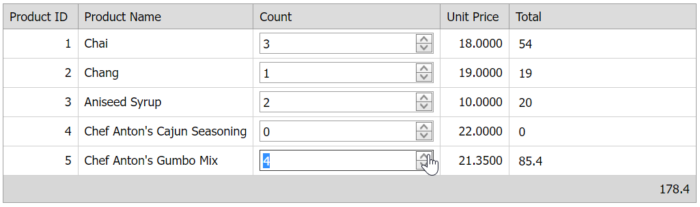

# Grid View for ASP.NET Web Forms - How to calculate bound and unbound column values on the client
<!-- run online -->
**[[Run Online]](https://codecentral.devexpress.com/e2961/)**
<!-- run online end -->

This example demonstrates how to create a bound and unbound columns and calculate their total values on the client.



## Overview

Create a bound (**Unit Price**) and unbound (**Count**) grid columns, specify the unbound column's [DataItemTemplate](https://docs.devexpress.com/AspNet/DevExpress.Web.GridViewDataColumn.DataItemTemplate) property, and add a spin editor to the template. 

```aspx
<dx:GridViewDataTextColumn VisibleIndex="2" FieldName="Count" UnboundType="Integer">
    <DataItemTemplate>
        <dx:ASPxSpinEdit ID="seCount" runat="server" Number="0" OnInit="spinEdit_Init" />
    </DataItemTemplate>
</dx:GridViewDataTextColumn>
<dx:GridViewDataTextColumn VisibleIndex="3" FieldName="UnitPrice" />
<dx:GridViewDataTextColumn FieldName="Total" UnboundType="Decimal" VisibleIndex="4">
    <DataItemTemplate>
        <dx:ASPxTextBox ID="tbTotal" runat="server" OnInit="tbTotal_Init" ReadOnly="True"
            Width="170px" Text="0" >
            <Border BorderStyle="None" />
        </dx:ASPxTextBox>
    </DataItemTemplate>
    <FooterTemplate>
        <dx:ASPxLabel ID="ASPxLabel1" runat="server" ClientInstanceName="lTotal" Text="0" />
    </FooterTemplate>
</dx:GridViewDataTextColumn>
```

To display the calculation results, create one more unbound column (**Total**), specify its `DataItemTemplate` property, and add a text box editor to the template. For a total summary, specify the column's [FooterTemplate](https://docs.devexpress.com/AspNet/DevExpress.Web.GridViewColumn.FooterTemplate) property and add a label to the template to replace a default summary item.

```aspx
<dx:GridViewDataTextColumn FieldName="Total" UnboundType="Decimal" VisibleIndex="4">
    <DataItemTemplate>
        <dx:ASPxTextBox ID="tbTotal" runat="server" OnInit="tbTotal_Init" ReadOnly="True"
            Width="170px" Text="0" >
            <Border BorderStyle="None" />
        </dx:ASPxTextBox>
    </DataItemTemplate>
    <FooterTemplate>
        <dx:ASPxLabel ID="ASPxLabel1" runat="server" ClientInstanceName="lTotal" Text="0" />
    </FooterTemplate>
</dx:GridViewDataTextColumn>
```

Handle the spin editor's server-side `Init` event to access the editor's template container and get the container's visible index. In the editor's client-side [ValueChanged](https://docs.devexpress.com/AspNet/js-ASPxClientEdit.ValueChanged) event handler, get the spin editor's value and assign the resulting value to the text box editor. To calculate the total summary, call the client-side `CalculateTotal` function. This function calculates the **Total** column values and displays the result in the column's footer.

```js
function CalculateTotal() {
    num = 0;
    var topVisibleIndex = grid.GetTopVisibleIndex();
    for (var i = topVisibleIndex; i < topVisibleIndex + grid.GetVisibleRowsOnPage(); i++) {
        var name = "txtBox" + i;
        var txtBox = eval(name);
        num += eval(txtBox.GetValue());
    }
    lTotal.SetText(num);
}
```

```cs
protected void spinEdit_Init(object sender, EventArgs e) {
    ASPxSpinEdit spin = sender as ASPxSpinEdit;
    GridViewDataItemTemplateContainer container = spin.NamingContainer as GridViewDataItemTemplateContainer;
    decimal price = (decimal)DataBinder.Eval(container.DataItem, "UnitPrice");		
    spin.ClientSideEvents.ValueChanged = String.Format("function(s, e) {{ var value = s.GetValue() * {1}; txtBox{0}.SetValue(value); CalculateTotal(); }}", container.VisibleIndex, price);
}
```

## Files to Review

* [Default.aspx](./CS/WebSite/Default.aspx) (VB: [Default.aspx](./VB/WebSite/Default.aspx))
* [Default.aspx.cs](./CS/WebSite/Default.aspx.cs) (VB: [Default.aspx.vb](./VB/WebSite/Default.aspx.vb))

## Documentation

* [Grid View Templates](https://docs.devexpress.com/AspNet/3718/components/grid-view/concepts/templates)

## More Examples

* [Grid View for ASP.NET Web Forms - How to use template editors to update the grid](https://github.com/DevExpress-Examples/how-to-perform-aspxgridview-instant-updating-using-different-editors-in-the-dataitem-template-e2333)
